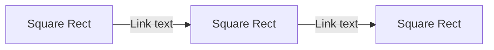

# 관리하자, 아파트 하자 관리 서비스


- 서비스 링크 : 
- 웹페이지 소스 코드 :
- colab 링크 :

<br>

## 팀원 정보
<table style="width:100% !important">
  <thead>
    <td>No</td>
    <td>이름</td>
    <td>학번</td>
    <td>역할</td>
  </thead>
  <tr>
    <td>&nbsp;1&nbsp;</td>
    <td>&nbsp;구지원&nbsp;</td>
    <td>&nbsp;소프트웨어학과&nbsp;</td>
    <td>&nbsp;웹 서비스/하자탐지 모델 API 개발 및 연동, PPT 제작&nbsp;</td>
  </tr>
  <tr>
    <td>&nbsp;2&nbsp;</td>
    <td>&nbsp;정윤호&nbsp;</td>
    <td>&nbsp;소프트웨어학과&nbsp;</td>
    <td>&nbsp;문서 정리 및 데이터 학습, PPT 제작&nbsp;</td>
  </tr>
  <tr>
    <td>&nbsp;3&nbsp;</td>
    <td>&nbsp;정재헌&nbsp;</td>
    <td>&nbsp;소프트웨어학과&nbsp;</td>
    <td>&nbsp;데이터 라벨링 및 하자탐지 모델 개발&nbsp;</td>
  </tr>
  <tr>
    <td>&nbsp;4&nbsp;</td>
    <td>&nbsp;최우린&nbsp;</td>
    <td>&nbsp;산업보안학과&nbsp;</td>
    <td>&nbsp;데이터 학습&nbsp;</td>
  </tr>
</table>

<br>

## 기본 정보
```
* OS
Windows 10, colab.research.google.com에서 실행

* Python 버전
Python 3.10.12

* 라이브러리
- yolov5
- requirements
```

<br>

## 프로젝트 개요
- 무엇을 하는 프로젝트이고, 어떤 카테고리로 어떻게 진행했는지 설명

<br>


## 실행 방법


<br>

## 결과
- 데이터의 수가 증가할 때마다 변화하는 그래프
