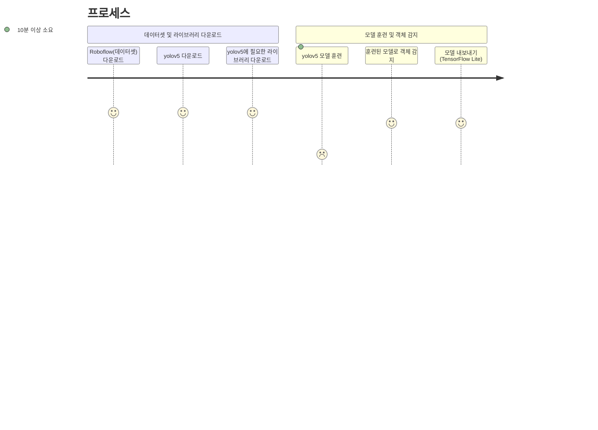

# 관리하자, 아파트 하자 관리 서비스


- <a href="http://openai.itkoo.kr">서비스 링크</a>
- <a href="https://colab.research.google.com/drive/1CKfAUHTwjHNii0wPwI2W3q1Y15Zg2-W4?usp=sharing">AI 모델 Colab 링크</a>
- <a href="https://github.com/ITKOO/AI-Based-Detecting-Defects-in-Apartments-Website">웹사이트 Github Repository</a>
<br>

## 팀원 정보
<table style="width:100% !important">
  <thead>
    <td>No</td>
    <td>이름</td>
    <td>학번</td>
    <td>역할</td>
  </thead>
  <tr>
    <td>&nbsp;1&nbsp;</td>
    <td>&nbsp;구지원&nbsp;</td>
    <td>&nbsp;소프트웨어학과&nbsp;</td>
    <td>&nbsp;웹 서비스 개발 및 API 연동 / Github 관리 / PPT 제작&nbsp;</td>
  </tr>
  <tr>
    <td>&nbsp;2&nbsp;</td>
    <td>&nbsp;정윤호&nbsp;</td>
    <td>&nbsp;소프트웨어학과&nbsp;</td>
    <td>&nbsp;문서 정리 / 데이터 수집 및 라벨링 / PPT 제작&nbsp;</td>
  </tr>
  <tr>
    <td>&nbsp;3&nbsp;</td>
    <td>&nbsp;정재헌&nbsp;</td>
    <td>&nbsp;소프트웨어학과&nbsp;</td>
    <td>&nbsp;하자탐지 모델 개발 및 학습&nbsp;</td>
  </tr>
  <tr>
    <td>&nbsp;4&nbsp;</td>
    <td>&nbsp;최우린&nbsp;</td>
    <td>&nbsp;산업보안학과&nbsp;</td>
    <td>&nbsp;데이터 수집 및 라벨링&nbsp;</td>
  </tr>
</table>

<br>

## 기본 정보
```
* OS
Windows 10, colab.research.google.com에서 실행

* Python 버전
Python 3.10.12

* 라이브러리
- yolov5 : 객체 검출을 위한 딥 러닝 모델, 5번째 버전
- matplotlib: 데이터 시각화 라이브러리
- numpy: 다차원 배열 및 행렬 연산
- torch (PyTorch): 딥 러닝
- opencv-python: 오픈소스 컴퓨터 비전 및 이미지 처리
- pillow: 이미지 처리
- PyYAML: YAML 파일 형식을 파싱
- tensorboard: 딥 러닝 모델의 훈련 진행 상황을 시각화
- torchvision: PyTorch의 컴퓨터 비전
- tqdm: 진행률 표시바
- scipy: 과학 및 공학 계산
- thop: PyTorch 모델의 FLOPs(Floating Point Operations)를 계산
```

<br>

## 프로젝트 개요
아파트 첫 입주자는 의무적으로 CS센터로부터 건물에 발생한<br>
하자에 대한 보수 책임을 받을 수 있습니다. (공동주택관리법 제 36조)<br>
이를`입주자 사전 점검` 과정이라고 말합니다.<br><br>

하지만, 이 과정에서 입주자는 하자를 쉽게 찾지 못하고,<br>
찾는다고 하더라도 여러개의 하자를 하나하나 등록해야합니다.<br>
전문적인 용어도 모르다 보니, 접수 받는 CS센터도 2번 일하게 됩니다.<br><br>

`사진을 찍으면 하자를 탐지해,`<br>
`[어떤 하자인지 / 고치는데 몇분이 소요되는지 / 해결방법] 은`<br>
`무엇인지 알려주는 것이 프로젝트의 목표이며`<br>
추후 자동으로 하자 보수 접수를 자동으로 등록해주고,<br>
반장님과의 보수 일정을 잡는 것까지 기능을 확대시키고 싶습니다.<br>
<br>

## 카테고리
CS 아웃소싱 업체와 인터뷰 후 자주 발생하는 8개의 하자를 찾아낼 수 있었습니다.<br>
해당 카테고리에 대한 하자를 탐자할 수 있는 모델을 개발했습니다.<br><br>


<br>

## 실행 방법

(아래 순서로 모델이 생성되며, 소요시간이 많을 수록 아이콘의 웃음이 없어집니다.)


### 아래 코드를 <a href="https://colab.research.google.com/drive/1CKfAUHTwjHNii0wPwI2W3q1Y15Zg2-W4?usp=sharing">구글 코랩</a>에 넣고 바로 실행시키면 결과 사진과 함께 모델이 export 됩니다.


``` python
# 사전 조건 : 테스트 할 사진 데이터 ex) 타일 줄눈 탈락
!curl -L "https://image.ohou.se/i/bucketplace-v2-development/uploads/advices/photos/156631004901716305.jpg?gif=1&w=600" -o /content/test.jpg

# 1. Roboflow(데이터셋) 다운로드 및 압축 해제
!curl -L "https://app.roboflow.com/ds/mogUAIJzK6?key=YH3zaHQok6" > roboflow.zip; unzip roboflow.zip; rm roboflow.zip

# 2. yolov5 다운로드
!git clone https://github.com/ultralytics/yolov5.git


# 3. 다운받은 yolov5 디렉토리로 경로 이동
%cd yolov5

# 4. yolov5에 필요한 라이브러리 설치
!pip install -r requirements.txt

# 5. yolov5 모델 훈련
"""
- 데이터셋 경로 등 관련 정보 : /content/data.yaml
- 학습에 사용할 모델 관련 정보 : ./models/yolov5s.yaml
- 학습에 사용할 모델 : yolov5s.pt
- 결과가 저장될 디렉토리 : FindDefect_results
"""

!python train.py --img 640 --batch 16 --epochs 50 --data /content/data.yaml --cfg ./models/yolov5s.yaml --weights yolov5s.pt --name FindDefect_results

# 6. 훈련된 모델로 객체 감지
"""
- 훈련 중 가장 성능이 좋은 모델로 가중치 설정 : ./runs/train/FindDefect_results/weights/best.pt
- 객체 감지할 사진(대상) : /content/test10.jpeg

임계값 0.5, 감지한 사진 결과는 /yolob5/runs/detect/exp 폴더에 저장
"""
!python detect.py --weights ./runs/train/FindDefect_results/weights/best.pt --conf 0.5 --source /content/test.jpg

# 7. 경로 이동
%cd /content/yolov5

# 8. 모델 내보내기(TensorFlow Lite)
!python export.py --weights runs/train/FindDefect_results/weights/best.pt --include tflite --img 416

# 결과 사진은 /yolob5/runs/detect/exp 폴더에 저장됩니다.
```

<br>

## 결과


